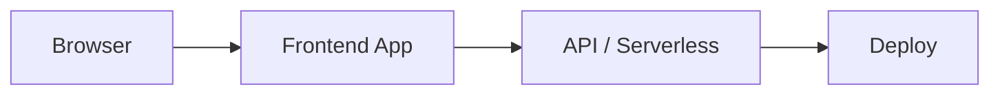

<p align="center">
  <picture>
    <source media="(prefers-color-scheme: dark)" srcset="https://img.shields.io/badge/Vitals.AI-Privacy--First%20Health%20Dashboard-10b981?style=for-the-badge&logo=data:image/svg%2bxml;base64,PHN2ZyB4bWxucz0iaHR0cDovL3d3dy53My5vcmcvMjAwMC9zdmciIHZpZXdCb3g9IjAgMCAyMCAyMCIgZmlsbD0id2hpdGUiPjxwYXRoIGZpbGxSdWxlPSJldmVub2RkIiBkPSJNMy4xNzIgNS4xNzJhNCA0IDAgMDE1LjY1NiAwTDEwIDYuMzQzbDEuMTcyLTEuMTcxYTQgNCAwIDExNS42NTYgNS42NTZMMT_agE3LjY1N2wtNi44MjgtNi44MjlhNCA0IDAgMDEwLTUuNjU2eiIgY2xpcFJ1bGU9ImV2ZW5vZGQiLz48L3N2Zz4=&logoColor=white">
    
  </picture>
</p>

<p align="center">
  <strong>🔬 AI-powered health analytics that never leave your machine</strong>
</p>

<p align="center">
  <a href="https://github.com/mangeshraut712/Vitals.AI">GitHub Repo</a> •
  <a href="https://mangeshraut712.github.io/Vitals.AI/">Live site (GitHub Pages)</a> •
  <a href="https://github.com/mangeshraut712/Vitals.AI/issues">Issues</a> •
  <a href="docs/VITALS_2.0.md">Vitals 2.0 Roadmap</a> •
  <a href="docs/OPENCLAW_INTEGRATION.md">OpenClaw Integration</a>
</p>

<p align="center">
  <a href="#features"></a>
  <a href="https://github.com/mangeshraut712/Vitals.AI/actions/workflows/ci.yml"></a>
  <a href="#tech-stack"></a>
  <a href="#tech-stack"></a>
  <a href="#tech-stack"></a>
  <a href="LICENSE"></a>
</p>

<p align="center">
  <a href="#-quick-start">Quick Start</a> •
  <a href="#-features">Features</a> •
  <a href="#-architecture">Architecture</a> •
  <a href="#-privacy">Privacy</a> •
  <a href="#-contributing">Contributing</a>
</p>

---

## 🎯 What is Vitals.AI?

**Vitals.AI** (OpenHealth) is a privacy-first health dashboard that analyzes your bloodwork, body composition, and activity data — all running locally on your machine. It uses OpenRouter-powered AI while ensuring your data stays under your control.

> **🔒 Privacy Promise:** Your health data is processed entirely on your machine. No external servers, no data collection, no tracking. External calls happen only to your user-configured OpenRouter API key, and you control when those happen.

### 📌 Current Release Snapshot (February 2026)

- OpenRouter-first AI runtime with optional FastAPI server-to-server proxy mode
- OpenClaw diagnostics + event dispatch pipeline (`/api/agent/diagnostics`, `/api/integrations/openclaw/dispatch`)
- Withings-inspired dashboard cards and refined body composition UI
- Upgraded digital twin rendering pipeline (React Three Fiber + Drei + postprocessing)
- PWA polish: app icons, install manifest, service worker improvements
- Hardened deployment checks via `npm run doctor` and `npm run deploy:check`
- Full validation path in CI: lint, typecheck, vitest, build

## ✨ Features

### 🔬 Biomarker Analysis
Upload lab results PDFs and get instant analysis of 40+ biomarkers with optimal range tracking, status indicators, and trend monitoring.

### 🧬 Biological Age (PhenoAge)
Calculate your biological age using the Levine PhenoAge algorithm — the gold standard for biological age estimation based on clinical biomarkers.

### 🏋️ Body Composition
Analyze DEXA scan results with detailed body fat %, lean mass, bone density, and regional composition breakdown.

### 📊 Activity Tracking
Import data from **Whoop**, **Apple Health**, **Oura**, and **Fitbit** to track HRV, sleep quality, recovery scores, steps, and workout data.

### 🤖 AI Health Assistant
Ask OpenRouter-powered AI questions about your health data. The assistant has full context of your biomarkers, body composition, and activity data to provide personalized insights.

### ⚡ Performance & Optimization
Optimized for speed with dynamic imports, lazy-loaded charts, and skeleton loaders. Reduces initial bundle size by ~40% for asset-heavy pages.

### 📈 Vitals Monitor
Real-time dashboard for monitoring key health metrics like Heart Rate, HRV, and Glucose with live updates.

### 🔌 Device Hub
Centralized management interface for connecting and syncing health devices (Oura, Whoop, Apple Watch).

### 🏠 Vitals 2.0 (Prototype)
Initial support for a database-backed architecture using **Prisma + SQLite**, featuring real-time device management and live health scoring.

### 👤 Digital Twin
3D visualization of your body composition data with real-time health metrics overlay.

### 🛰️ OpenClaw Automation (Optional)
Forward warning/critical health events to OpenClaw hooks with redacted payloads for external alerting and workflow triage.

### 🧠 Advanced Health Analytics
Predictive trend analysis using linear regression, metabolic & cardiovascular risk scoring, and automated anomaly detection for early warning signs.

### 🛡️ Enterprise-Grade Security
Built-in input sanitization, Content Security Policy (CSP), rate limiting, and CSRF protection to ensure data integrity and safety.

### 📱 PWA & Offline Support
Fully installable Progressive Web App (PWA) with offline support, service workers, and background sync capabilities for reliable access anywhere.

## 🚀 Quick Start

### Prerequisites

- **Node.js** 20+ and **npm** 10+
- **OpenRouter API Key** (required for AI features, [Get one here](https://openrouter.ai/keys))

### Installation

```bash
# Clone the repository
git clone https://github.com/mangeshraut712/Vitals.AI.git
cd Vitals.AI

# Install dependencies
npm ci

# Set up your API key
cp .env.example .env.local
# Edit .env.local and add your OPENROUTER_API_KEY
# Optional: OPENROUTER_MODEL=<your preferred OpenRouter model>

# Start the development server
npm run dev
```

Open [http://localhost:3000](http://localhost:3000) to see your dashboard.

### Adding Your Data

Place your health data files in the `/data` directory:

```
data/
├── Bloodwork/           # Lab results PDFs
│   └── lab_results.pdf
├── Body Scan/           # DEXA scan PDFs
│   └── dexa_scan.pdf
└── Activity/            # Activity tracker exports
    ├── Whoop/           # Whoop CSV exports
    ├── Apple Health/    # Apple Health XML export
    ├── Oura/            # Oura CSV/JSON exports
    └── Fitbit/          # Fitbit CSV exports
```

After adding files, click **"Sync Data"** in the top-right corner to process them.

### OpenClaw Integration (Optional)

OpenHealth can push a redacted event digest to OpenClaw when you click **"Send to OpenClaw"** in the **Health Event Feed**.

1. Configure `.env.local`:

```bash
OPENCLAW_ENABLED=true
OPENCLAW_HOOKS_BASE_URL=http://127.0.0.1:18789
OPENCLAW_HOOKS_PATH=/hooks
OPENCLAW_HOOKS_TOKEN=your-openclaw-hooks-token
OPENCLAW_HOOK_MODE=wake
OPENCLAW_EVENT_SEVERITIES=warning,critical
OPENCLAW_INCLUDE_SUMMARY=false
OPENCLAW_AUTO_DISPATCH_ON_SYNC=false
```

2. Trigger dispatch manually from UI, or call:

```bash
curl -X POST http://localhost:3000/api/integrations/openclaw/dispatch \
  -H "Content-Type: application/json" \
  -d '{"severities":["warning","critical"],"limit":20}'
```

Notes:
- Event values are excluded by default from OpenClaw payloads.
- `OPENCLAW_HOOK_MODE=agent` is supported for agent-based triage in OpenClaw.
- Set `OPENCLAW_AUTO_DISPATCH_ON_SYNC=true` to automatically notify OpenClaw after each data sync.

## 🏗️ Architecture

```
┌─────────────────────────────────────────────────────────┐
│                    Browser (Next.js SSR)                 │
│  ┌─────────┐  ┌──────────┐  ┌───────────┐  ┌────────┐  │
│  │Dashboard │  │Biomarkers│  │ Lifestyle │  │Body    │  │
│  │  Page    │  │  Page    │  │   Page    │  │Comp    │  │
│  └────┬─────┘  └────┬─────┘  └─────┬─────┘  └───┬────┘  │
│       │              │              │             │       │
│  ┌────┴──────────────┴──────────────┴─────────────┴────┐  │
│  │              HealthDataStore (Singleton)             │  │
│  │  ┌──────────┐  ┌──────────┐  ┌──────────────────┐   │  │
│  │  │  Parser  │  │Extractor │  │  PhenoAge Calc   │   │  │
│  │  │  (PDF,   │  │  (AI +   │  │  (Levine 2018)   │   │  │
│  │  │ CSV, XML)│  │ Fallback)│  └──────────────────┘   │  │
│  │  └──────────┘  └──────────┘                          │  │
│  └──────────────────────────────────────────────────────┘  │
│                                                           │
│  ┌──────────────────────────────────────────────────────┐  │
│  │           /data (local filesystem)                    │  │
│  │  Bloodwork/ │ Body Scan/ │ Activity/{Whoop,Apple,...} │  │
│  └──────────────────────────────────────────────────────┘  │
│                                                           │
│  ┌──────────────────────────────────────────────────────┐  │
│  │      AI Providers (External API, user-configured)      │  │
│  │   OpenRouter (Chat + Extraction + Goals)               │  │
│  └──────────────────────────────────────────────────────┘  │
└─────────────────────────────────────────────────────────┘
```

### Key Design Decisions

| Decision | Rationale |
|----------|-----------|
| **Server-side rendering** | Health data is parsed on the server, keeping the client lean |
| **AI extraction with fallback** | AI extracts biomarkers from PDFs, with regex fallback |
| **File-based caching** | Avoids re-processing unchanged files on every page load |
| **Performance Optimization** | Lazy loading and dynamic imports for heavy 3D and chart components |
| **Skeleton Loaders** | Enhances perceived performance during asynchronous component loading |
| **Singleton data store** | Single source of truth for all health data |
| **Dark mode first** | Reduces eye strain for a health monitoring dashboard |

## 🛡️ Privacy

Vitals.AI takes your privacy seriously:

- ✅ **All data stays local** — Files are read from your `/data` folder, never uploaded
- ✅ **No database** — No persistent storage beyond file-based cache
- ✅ **No tracking** — Zero analytics, telemetry, or third-party scripts
- ✅ **No accounts** — No login, no user data collection
- ✅ **Transparent AI** — Only user-configured AI API calls are made externally, and you control when
- ✅ **Security headers** — X-Content-Type-Options, X-Frame-Options, strict Referrer-Policy

## 🛠️ Tech Stack

| Category | Technology |
|----------|------------|
| **Framework** | Next.js 16.1.1 (App Router, SSR/ISR, API routes) |
| **Language** | TypeScript 5.9.3 |
| **UI Runtime** | React 19.2.3, React DOM 19.2.3 |
| **Styling & Motion** | Tailwind CSS 4, next-themes, Framer Motion 12 |
| **AI Layer** | Vercel AI SDK 6 (`ai`) + OpenAI-compatible provider (`@ai-sdk/openai`) via OpenRouter |
| **3D & Twin Rendering** | three 0.182, `@react-three/fiber` 9, `@react-three/drei` 10, `@react-three/postprocessing` |
| **Charts & Visualization** | Recharts 3.6, custom sparkline components |
| **Validation & Schemas** | Zod 4 |
| **Data & Persistence** | Prisma 5 + SQLite (prototype modules), file-based ingestion/cache for local-first mode |
| **Parsing Pipeline** | `pdf-parse`, `papaparse`, `xlsx`, `fast-xml-parser` |
| **Testing** | Vitest 4 (unit/integration), Playwright 1.58 (e2e smoke) |
| **Security** | Input validation, CSP/security headers, rate limiting, webhook signature checks |
| **PWA** | `manifest.json`, service worker (`sw.js`), installable app icons |

## 📁 Project Structure

```
OpenHealth/
├── src/
│   ├── app/                            # Next.js App Router
│   │   ├── (main)/                     # Main product routes + shared layout
│   │   │   ├── dashboard/
│   │   │   ├── biomarkers/
│   │   │   ├── body-comp/
│   │   │   ├── lifestyle/
│   │   │   ├── vitals/
│   │   │   ├── devices/
│   │   │   ├── data-sources/
│   │   │   ├── goals/
│   │   │   ├── future/
│   │   │   ├── plans/
│   │   │   └── tools/
│   │   ├── api/                        # Server routes
│   │   │   ├── chat/
│   │   │   ├── goals/
│   │   │   ├── sync/
│   │   │   ├── events/
│   │   │   ├── cache/clear/
│   │   │   ├── future/stats/
│   │   │   ├── integrations/openclaw/dispatch/
│   │   │   └── webhooks/terra/
│   │   ├── layout.tsx
│   │   ├── page.tsx
│   │   ├── globals.css
│   │   ├── robots.ts
│   │   └── sitemap.ts
│   ├── components/                     # UI + domain components
│   │   ├── ai-chat/
│   │   ├── biomarkers/
│   │   ├── body-comp/
│   │   ├── charts/
│   │   ├── dashboard/
│   │   ├── digital-twin/
│   │   ├── future/
│   │   ├── goals/
│   │   ├── insights/
│   │   ├── layout/
│   │   └── ui/
│   ├── features/
│   │   └── sync/
│   ├── hooks/
│   ├── lib/                            # Business logic + parsing + integrations
│   │   ├── agent/
│   │   ├── ai-chat/
│   │   ├── analysis/
│   │   ├── biomarkers/
│   │   ├── cache/
│   │   ├── calculations/
│   │   ├── design/
│   │   ├── digital-twin/
│   │   ├── extractors/
│   │   ├── integrations/
│   │   ├── lifestyle/
│   │   ├── parsers/
│   │   ├── security/
│   │   ├── store/
│   │   ├── terra/
│   │   ├── types/
│   │   └── validation/
│   └── types/
├── docs/                               # Architecture, roadmap, integrations
├── data/                               # Local user files (gitignored content)
├── prisma/                             # Prisma schema + local DB artifacts
└── public/                             # Static assets (manifest + service worker)
```

## 🧪 Development

```bash
# Run development server
npm run dev

# Run terminal/project preflight checks (permissions, stale locks, next-env)
npm run doctor

# Validate hosted env contract before Vercel deployment
npm run deploy:check

# Type checking
npm run typecheck

# Linting
npm run lint

# Run tests
npm run test

# Run tests with UI
npm run test:ui

# Build for production
npm run build
```

### Terminal Troubleshooting (macOS)

If you see `EPERM`, `next-env.d.ts not found`, or `.next/dev/lock` errors:

```bash
# Fix ownership/permissions in project
sudo chown -R "$USER":staff .
chmod -R u+rwX .
chflags -R nouchg,noschg .
/usr/bin/xattr -dr com.apple.quarantine . 2>/dev/null || true

# Run built-in checks
npm run doctor

# If .next/dev/lock is active, stop old Next.js dev process first
pkill -f "next-server" || true
```

Notes:
- The repo uses a local npm cache (`.npm-cache`) to avoid global cache permission issues.
- Running from `~/Projects` is more reliable than `~/Downloads` on macOS sandboxed terminals.

### Quality Gates (GitHub)

- CI workflow at `.github/workflows/ci.yml` runs `lint`, `typecheck`, `test`, and `build` for pushes and pull requests to `main`.
- Dependency versions are reviewed and updated manually; Dependabot is not used.
- PR checklist template at `.github/pull_request_template.md` keeps validation and deployment notes consistent.

### Secrets Hygiene

- Keep real credentials only in `.env.local` (gitignored).
- Never put API keys/tokens in committed files, screenshots, or issue comments.
- Do not use `NEXT_PUBLIC_*` for secrets (those are exposed to the browser).
- If a key is exposed, rotate it immediately in the provider dashboard.

## ☁️ Deploy on GitHub Pages (public site)

The public site is a **static export** at [https://mangeshraut712.github.io/Vitals.AI/](https://mangeshraut712.github.io/Vitals.AI/). Vercel is not used.

GitHub Actions workflow `.github/workflows/pages.yml` runs `npm run build:pages` on `main` and publishes the `out/` directory.

### What the static site includes

- All main UI routes (home, dashboard, biomarkers, body composition, lifestyle, goals, experience, devices, vitals, plans, tools).
- `basePath` / `assetPrefix` `/Vitals.AI` for project Pages.
- Empty local `/data` at build time, so biomarker/activity cards show empty states unless you bake files into the repo (do not commit private health data).

### What requires a local Node server

Route handlers under `src/app/api` (chat, sync, goals persistence, Terra webhooks, Prisma-backed Vitals 2.0 stats) **cannot run on GitHub Pages**. Use `npm run dev` or `npm run build && npm start` on your machine for AI chat, `/data` sync, and API diagnostics.

The `/future` page falls back to bundled demo stats when `/api/future/stats` is unavailable.

### Local static export

```bash
npm ci
npm run build:pages
# Serve like GitHub Pages (project site under /Vitals.AI/)
python3 -m http.server 8080 --directory out
# then open http://127.0.0.1:8080/  — or nest under /Vitals.AI for a true path check
```

### GitHub Pages setup

1. Repo Settings → Pages → **Source: GitHub Actions** (the workflow also creates this on first deploy).
2. Repository homepage URL: `https://mangeshraut712.github.io/Vitals.AI/`
3. After merge to `main`, verify:

```bash
curl -I https://mangeshraut712.github.io/Vitals.AI/
curl -I https://mangeshraut712.github.io/Vitals.AI/dashboard/
curl -I https://mangeshraut712.github.io/Vitals.AI/experience/
```

Expected: HTTP 200 for HTML routes. `/api/*` is not served.

### Full-stack local hosting (APIs)

For OpenRouter chat, file sync, and Prisma:

```bash
npm ci
cp .env.example .env.local
npm run build
npm start
npm run deploy:check   # optional
```

## 🎨 Design System

Vitals.AI uses a premium dark-first design system with:

- **Glassmorphism cards** with backdrop blur and subtle borders
- **Status colors**: Emerald (optimal), Amber (normal), Rose (out of range)
- **Gradient accents**: Emerald → Cyan → Purple AI gradient
- **Smooth animations**: Fade-in entrance, heartbeat pulse, skeleton loading
- **Responsive design**: Mobile-first with graceful scaling
- **Accessibility**: Reduced motion support, proper focus indicators, semantic HTML

## 🤝 Contributing

Contributions are welcome. Read [CONTRIBUTING.md](CONTRIBUTING.md) and [docs/ARCHITECTURE.md](docs/ARCHITECTURE.md) before opening a pull request.

1. Fork the repository
2. Create your feature branch (`git checkout -b feature/amazing-feature`)
3. Commit your changes (`git commit -m 'Add amazing feature'`)
4. Push to the branch (`git push origin feature/amazing-feature`)
5. Open a Pull Request

## 📄 License

This project is open-source under the [MIT License](LICENSE).

## 🔐 Security

If you discover a security issue, follow [SECURITY.md](SECURITY.md) and avoid posting sensitive details in public issues.

---

<p align="center">
  <sub>Built with ❤️ for health-conscious developers</sub>
</p>

---

<!-- codex:project-diagram:start -->

## Project Diagram



_High-level flow of the deployed web experience and supporting services._

<!-- codex:project-diagram:end -->
