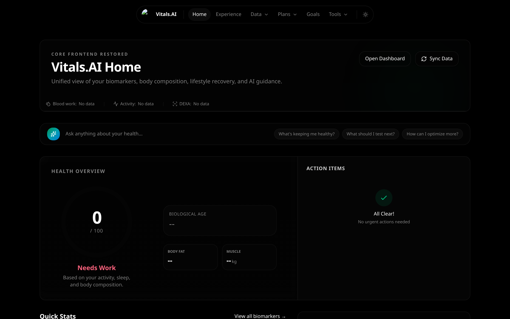
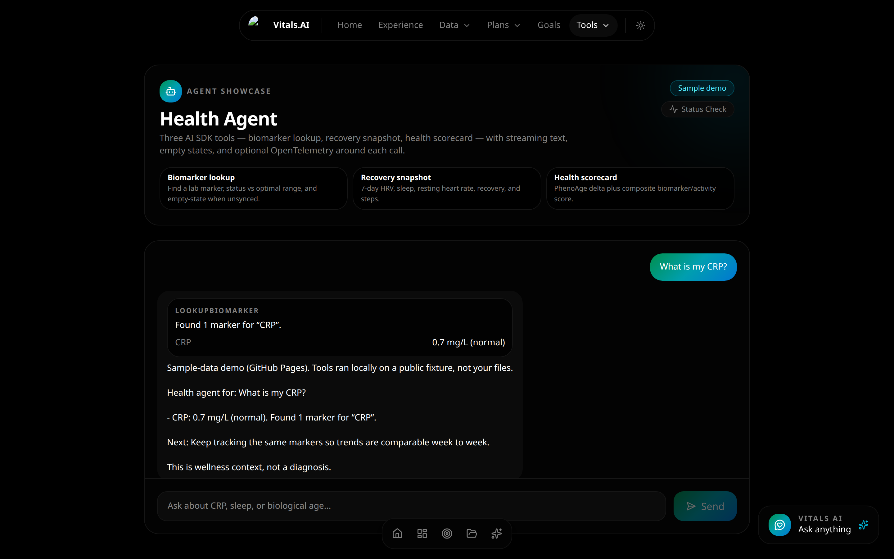

# Vitals.AI

Privacy-first health analytics dashboard with a tool-calling health agent.

- **Live site:** [https://mangeshraut712.github.io/Vitals.AI/](https://mangeshraut712.github.io/Vitals.AI/)
- **Repo:** [github.com/mangeshraut712/Vitals.AI](https://github.com/mangeshraut712/Vitals.AI)
- **Agent UI:** [/tools/agent](https://mangeshraut712.github.io/Vitals.AI/tools/agent/)

[](https://github.com/mangeshraut712/Vitals.AI/actions/workflows/ci.yml)
[](https://github.com/mangeshraut712/Vitals.AI/actions/workflows/pages.yml)

**Dashboard** — health overview, biomarkers, and digital twin on the live Pages demo (September 2026).



**Health agent** — AI SDK tools with streamed answers and json-render cards (`lookupBiomarker` for CRP on the public sample panel).



## What this is

Vitals.AI parses local lab PDFs, DEXA scans, and wearable exports, then renders biomarkers, PhenoAge, body composition, and a 3D digital twin. The **health agent** is the September 2026 showcase surface: AI SDK tool calling, streamed answers, and json-render cards for tool results.

The public GitHub Pages build is a **static export**. Chat APIs do not run there. The agent page still demonstrates the three tools against a bundled sample panel. For live OpenRouter streaming against your own `/data` files, run the Next.js server locally.

## Agent tools

| Tool | What it does |
|------|----------------|
| `lookupBiomarker` | Resolves a lab marker (or `summary`) against longevity ranges; empty if no labs |
| `getRecoverySnapshot` | 7-day HRV / sleep / RHR / recovery / steps; empty if no wearables |
| `getHealthScorecard` | Composite score + Levine PhenoAge delta |

On Pages, a deterministic router selects tools. Locally, with `OPENROUTER_API_KEY`, `streamText` can choose the same tools through the AI SDK.

## Quick start

Requires **Node 22+**.

```bash
git clone https://github.com/mangeshraut712/Vitals.AI.git
cd Vitals.AI
npm ci
cp .env.example .env.local   # add OPENROUTER_API_KEY for live model streaming
npm run dev
```

Open http://localhost:3000 and `/tools/agent`. Put files under `/data` (Bloodwork, Body Scan, Activity) and click **Sync Data**.

## Evals and smoke

CI (`quality`/`validate` + `smoke`) does not call paid APIs. Evals mock the model and use fixtures.

```bash
npm run test            # Vitest, including evals
npm run test:evals      # tool selection + structured-output evals only
npm run test:e2e:smoke  # Pages export → homepage + /tools/agent tool path
npm run test:e2e        # broader Playwright against `next start` (local)
```

`test:e2e:smoke` runs `build:pages` unless `out/` already exists and `E2E_SKIP_BUILD=1`.

## Observability

Agent and tool calls use OpenTelemetry API spans. The SDK is off until you enable it.

```bash
# Console exporter
OTEL_ENABLED=1 npm run dev

# OTLP HTTP (Jaeger / collector on :4318)
OTEL_EXPORTER_OTLP_ENDPOINT=http://127.0.0.1:4318 npm run dev
```

`src/instrumentation.ts` registers the Node tracer provider. AI SDK `experimental_telemetry` is enabled when tracing is on. No traces leave the machine unless you set an OTLP endpoint.

## Architecture

```
Browser UI ──► /tools/agent (stream + json-render tool cards)
                 │
                 ├─ GitHub Pages: deterministic tools on DEMO_HEALTH_SNAPSHOT
                 └─ Local Node:  /api/chat
                                  ├─ HealthDataStore (/data parsers + cache)
                                  ├─ AI SDK tools (lookup / recovery / scorecard)
                                  └─ OpenRouter streamText (optional key)
OTel spans wrap agent + tool execute. Evals mock generateObject / tool calls.
```

Static hosting is GitHub Pages only (`basePath` `/Vitals.AI`). Do not treat `/api/*` as part of the public site.

```bash
npm run build:pages
node scripts/serve-pages.mjs
# http://127.0.0.1:4173/Vitals.AI/
```

Workflow: `.github/workflows/pages.yml` publishes `out/` from `main`.

## Stack

Next.js 16, React 19, TypeScript 5.9 strict, Node 22, AI SDK (`ai` + `@ai-sdk/openai`), json-render, Zod, Vitest, Playwright, OpenTelemetry.

## Privacy

Health files stay in `/data`. Pages deploys an empty data tree plus a **public sample** used only by the agent demo. Do not commit real labs. External calls happen only when you set an API key (OpenRouter) or an OTLP endpoint.

## More

- [docs/ARCHITECTURE.md](docs/ARCHITECTURE.md)
- [CONTRIBUTING.md](CONTRIBUTING.md)
- [SECURITY.md](SECURITY.md)
- MIT [LICENSE](LICENSE)
